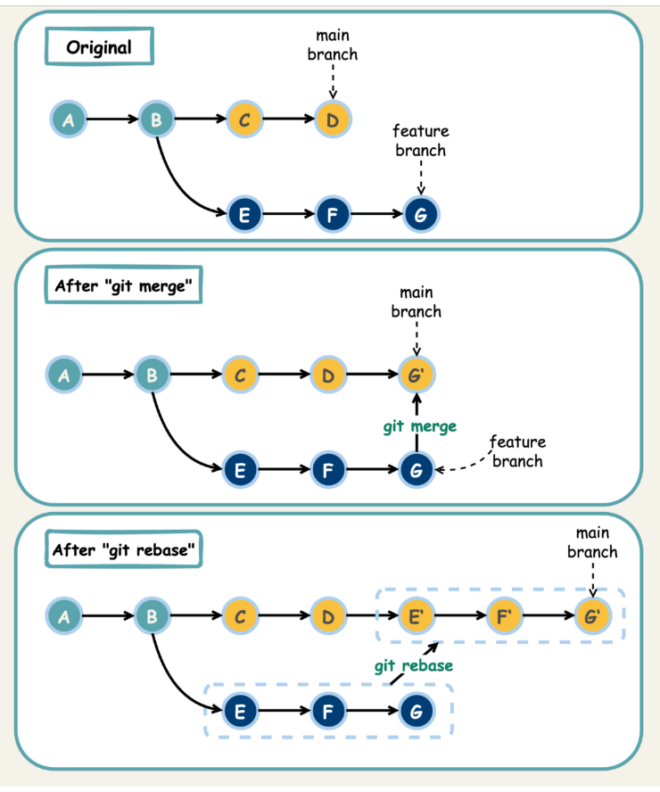

# Day 32: Git Rebase

## task:
The Nautilus application development team has been working on a project repository `/opt/beta.git`. This repo is cloned at `/usr/src/kodekloudrepos` on storage server in Stratos DC. They recently shared the following requirements with DevOps team:

One of the developers is working on feature branch and their work is still in progress, however there are some changes which have been pushed into the master branch, the developer now wants to rebase the feature branch with the master branch without loosing any data from the feature branch, also they don't want to add any merge commit by simply merging the master branch into the feature branch. Accomplish this task as per requirements mentioned.

Also remember to push your changes once done.

## Solution:
```bash
# Step 1: Navigate to the local repository
cd /usr/src/kodekloudrepos

# Step 2: Check the current branch
git branch

# Step 3: Switch to the feature branch
git checkout feature-branch

# Step 4: Rebase the feature branch with the master branch
git rebase master
# Step 5: Resolve any conflicts if they arise, then continue the rebase process
# After resolving conflicts, use:
git add .
git rebase --continue

# Step 6: Push the rebased feature branch to the remote repository
git push origin feature-branch --force
```



 