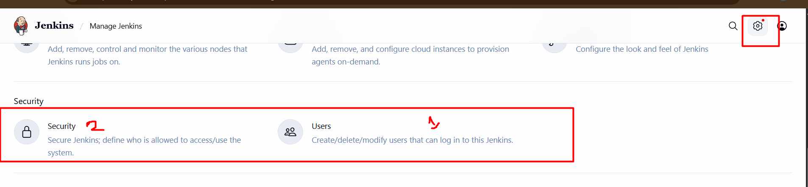
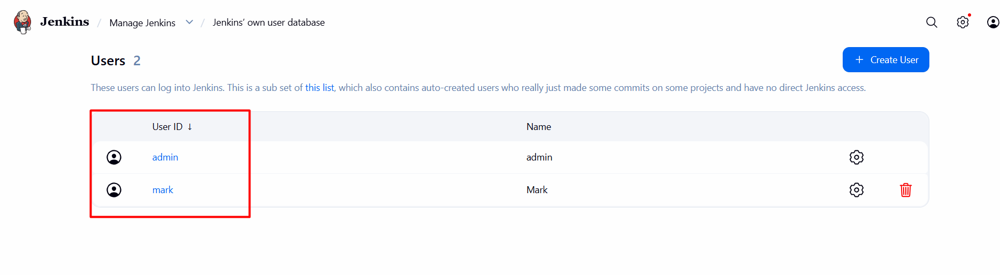
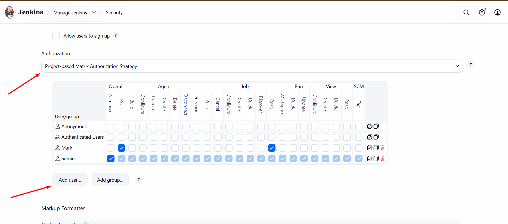
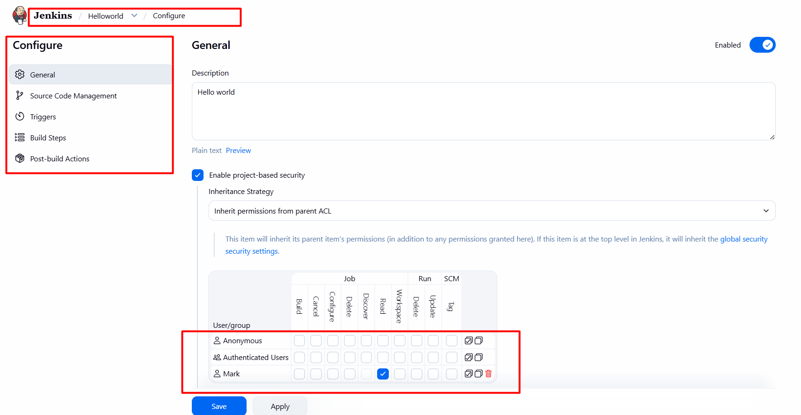

# Day 70: Configure Jenkins User Access

## 🎯 task
1. Click on the Jenkins button on the top bar to access the Jenkins UI. Login with username admin and password Adm!n321.

2. Create a jenkins user named mark with the password ksH85UJjhb. Their full name should match Mark.

3. Utilize the Project-based Matrix Authorization Strategy to assign overall read permission to the mark user.

4. Remove all permissions for Anonymous users (if any) ensuring that the admin user retains overall Administer permissions.

5. For the existing job, grant mark user only read permissions, disregarding other permissions such as Agent, SCM etc.

Note:

1. You may need to install plugins and restart Jenkins service. After plugins installation, select Restart Jenkins when installation is complete and no jobs are running on plugin installation/update page.

## Solution:

1. Open the Jenkins UI from the top bar and log in:

   * Username: `admin`
   * Password: `Adm!n321`

2. Install the required authorization plugin:

   * Go to **Manage Jenkins → Plugins**
   * Under **Available Plugins**, search for:

     *  **Matrix Authorization Strategy**
   * Install it.
   * Select **Restart Jenkins when installation is complete and no jobs are running**.

3. Create the user `mark`:

   * Go to **Manage Jenkins → Security → Users**
     (or **Manage Jenkins → Manage Users** depending on UI version)
   * Click **Create User**
   * Fill in:

     * Username: `mark`
     * Password: `ksH85UJjhb`
     * Confirm password: `ksH85UJjhb`
     * Full name: `Mark`
   * Save.

4. Configure Project-based Matrix Authorization:

   * Go to **Manage Jenkins → Security**
   * In the **Authorization** section select:

     * **Project-based Matrix Authorization Strategy**
   * Ensure `admin` has:
     * `Overall → Administer`

   * Add user `mark`

   * Grant `mark` only:
     * `Overall → Read`
   * Remove all permissions from:
     * `Anonymous`
   * Save.

5. Configure permissions for the existing job:

   * Open the existing Jenkins job.
   * Click **Configure**
   * Enable **Enable project-based security** (if available).
   * In the project matrix:

     * Add user `mark`
     * Grant only:

       * `Job → Read`
     * Do not grant Build, Configure, Workspace, SCM, Agent, or any other permissions.
   * Save the job configuration.

6. Verify:

   * Log out.
   * Log in as:

     * Username: `mark`
     * Password: `ksH85UJjhb`
   * Confirm:

     * Jenkins dashboard is viewable.
     * Existing job is readable.
     * No admin or build permissions are available.

    

    

    

    

