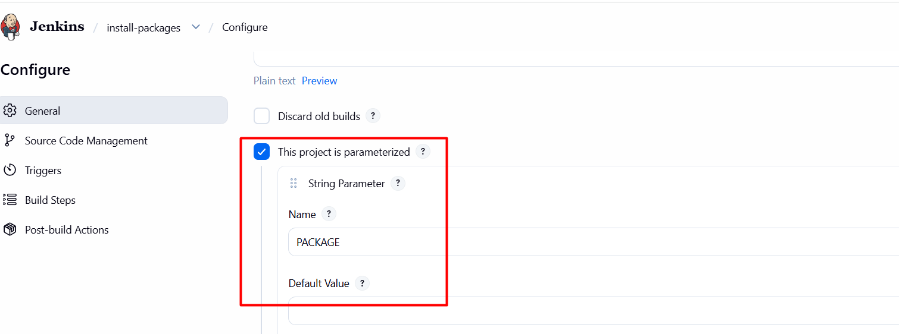
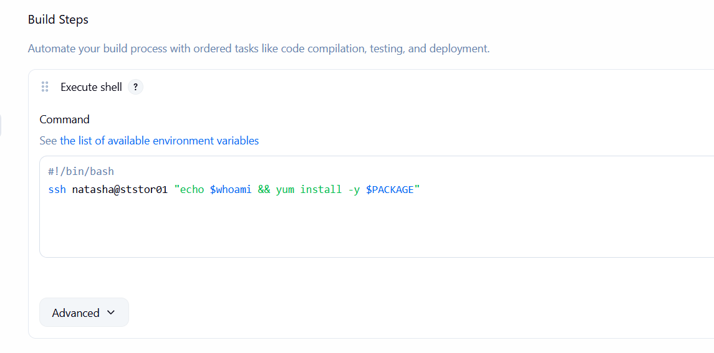
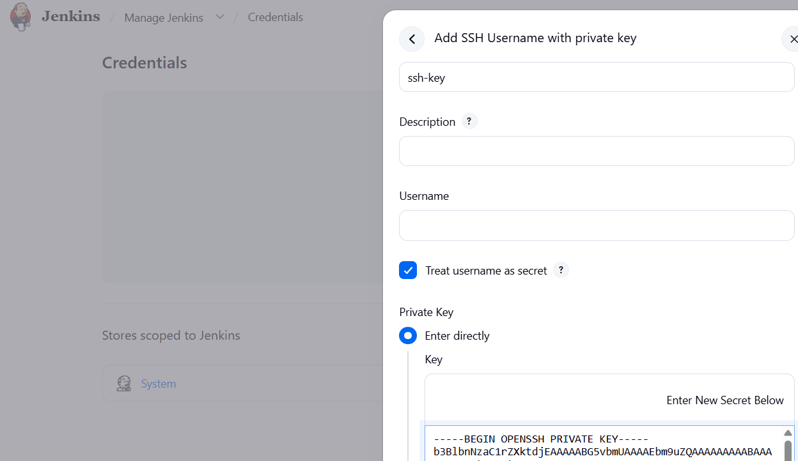

# Day 71: Configure Jenkins Job for Package Installation

## 🎯 task
1. Access the Jenkins UI by clicking on the Jenkins button in the top bar. Log in using the credentials: username `admin` and password `Adm!n321`.


2. Create a new Jenkins job named `install-packages` and configure it with the following specifications:

- Add a string parameter named `PACKAGE`.

- Configure the job to install a package specified in the `$PACKAGE` parameter on the storage server (Stratos Datacenter).

- Build the job at least once (e.g. with parameter PACKAGE=vim-enhanced) so the package is installed on the Storage server and can be verified.

## 🧑‍💻 solution

###  Save ssh key in jenkins. install ssh plugin if not already installed.
**Manage Jenkins** > **Manage Credentials** > **Global credentials** > **Add Credentials**.
- Select "SSH Username with private key"

### job with "Freestyle project".

- In the job configuration >  `Build` section and click `Add build step`. Select `Execute shell`.

- In the command box, save the script to install
```bash
#!/bin/bash
ssh root@stratos "yum install -y $PACKAGE"
```









Follow these exact steps to complete the task successfully.


# 1. Install Required Plugin

Go to:

```text
Manage Jenkins → Plugins
```
Install:

```text
SSH Agent Plugin
```

After installation:

```text
Restart Jenkins when installation is complete
```

---

# 2. Configure SSH Access From Jenkins to Storage Server

Login to the Jenkins server terminal.

Switch to Jenkins user:

```bash
sudo su - jenkins
```

Generate SSH key:

```bash
ssh-keygen -t rsa -b 4096
```

Press Enter for all prompts.

Copy key to storage server:

```bash
ssh-copy-id natasha@ststor01
```

Verify passwordless SSH works:

```bash
ssh natasha@ststor01
```

Exit remote host:

```bash
exit
```

Add host key to known_hosts (optional but recommended):

```bash
ssh-keyscan -H ststor01 >> ~/.ssh/known_hosts
chmod 600 ~/.ssh/known_hosts
```

---

# 3. Add SSH Credential in Jenkins (optional)

Go to:

```text
Manage Jenkins → Credentials → Global → Add Credentials
```

Configure:

```text
Kind: SSH Username with private key
Username: natasha
Private Key: Enter directly
```

Paste contents of:

```bash
cat ~/.ssh/id_rsa
```

Save it.

---

# 4. Create Jenkins Job

Select project style:

```text
Freestyle Project
```

---

# 5. Add String Parameter

Enable:

```text
This project is parameterized
```

Add:

```text
String Parameter
```

Configure:

```text
Name: PACKAGE
Default Value: vim-enhanced
```

---

# 7. Configure SSH Agent 

Under:

```text
Build Environment
```

Enable:

```text
SSH Agent
```

Select your SSH credential.

---

# 8. Add Build Step

Go to:

```text
Build → Add Build Step → Execute Shell
```

Add:

```bash
ssh natasha@ststor01 "sudo yum install -y $PACKAGE"
```

Save the job.

---

# 9. Build the Job

Click:

```text
Build with Parameters
```

Enter:

```text
PACKAGE=vim-enhanced
```

Run build.

---

# 10. Verify Installation

SSH to storage server:

```bash
ssh natasha@ststor01
```

Verify package:

```bash
rpm -q vim-enhanced
```

Expected:

```text
vim-enhanced-...
```

---

# 11. Re-run for Reliability

Run again with another package:

```text
PACKAGE=git
```

or:

```text
PACKAGE=wget
```

Ensure builds succeed repeatedly.

---

# 12. Screenshots Required

Capture screenshots of:

1. Installed SSH Agent plugin
2. Jenkins credentials
3. Parameter configuration
4. SSH Agent configuration
5. Execute shell command
6. Successful build output
7. Package verification on storage server

Or create a Loom recording documenting the setup and execution flow.
