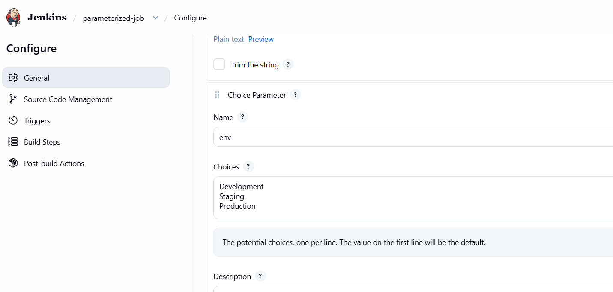
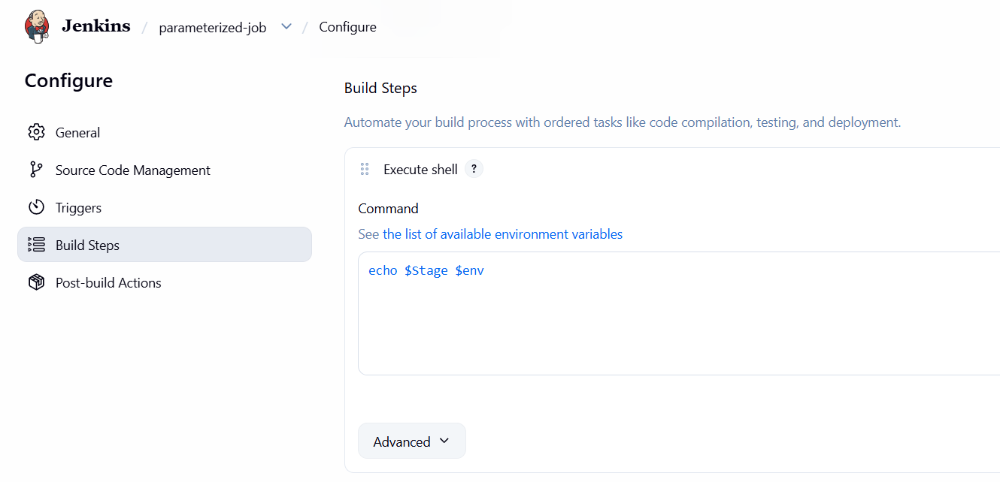
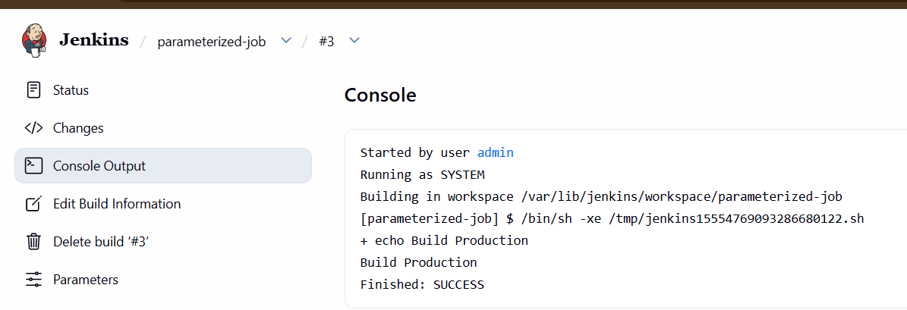

# Day 72: Jenkins Parameterized Builds

## 🎯 task
1. Create a parameterized job which should be named as parameterized-job

2. Add a string parameter named Stage; its default value should be Build.

3. Add a choice parameter named env; its choices should be Development, Staging and Production.

4. Configure job to execute a shell command, which should echo both parameter values (you are passing in the job).

5. Build the Jenkins job at least once with choice parameter value Production to make sure it passes.

