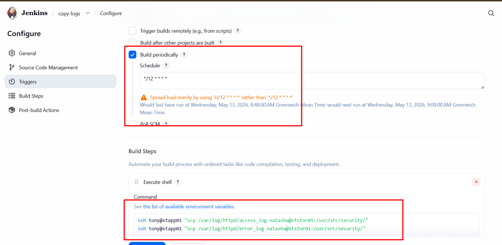

# Day 73: Jenkins Scheduled Jobs

## 🎯 task 

1. Create a Jenkins jobs named copy-logs.

2. Configure it to periodically build every 12 minutes to copy the Apache logs (both access_log and error_log) from App Server 1 (stapp01) from the default logs location to location /usr/src/security on the Storage Server.


3. Build the job at least once so that the logs are copied and can be verified.


Note:

1. You might need to install some plugins and restart Jenkins. We recommend selecting Restart Jenkins when installation is complete and no jobs are running in the update centre. Refresh the page if the UI gets stuck after a restart.

2. Define the cron expression as required (e.g. */10 * * * * to run every 10 minutes).

3. For scenarios that require web UI changes, take screenshots or record your work (e.g. using loom.com) so you can share it for review if the task is marked incomplete.


## 🧑‍💻 solution

**copy ssh-rsa-id from jenkins server to app server's ~/.ssh/authorized_keys**
```bash
ssh-copy-id tony@stapp01
```

**copy ssh-rsa-id from app server to storage server's ~/.ssh/authorized_keys**
```bash
ssh-copy-id natasha@ststor01
```

## jenkin job configuration
- In the job configuration >  `Build` section and click `Add build step`. Select `Execute shell`.
```bash
ssh tony@stapp01 "scp /var/log/httpd/access_log natasha@ststor01:/usr/src/security/"
ssh tony@stapp01 "scp /var/log/httpd/error_log natasha@ststor01:/usr/src/security/"
```


