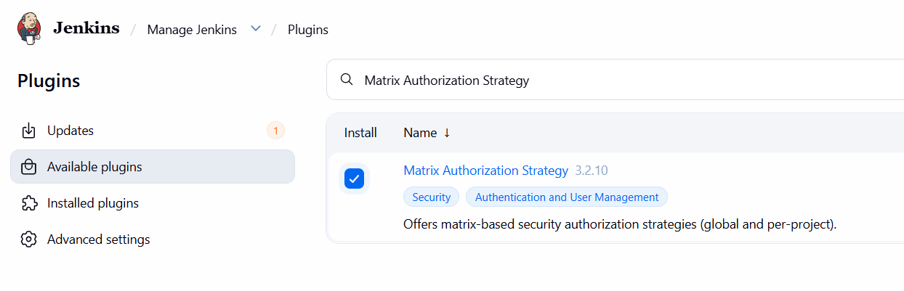
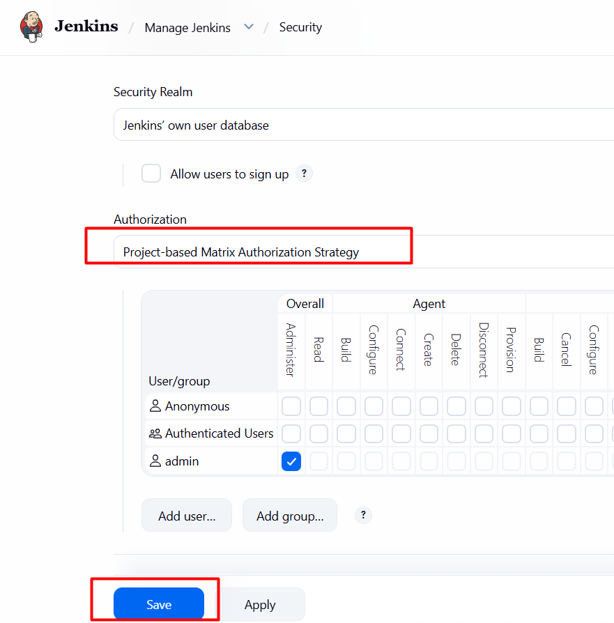
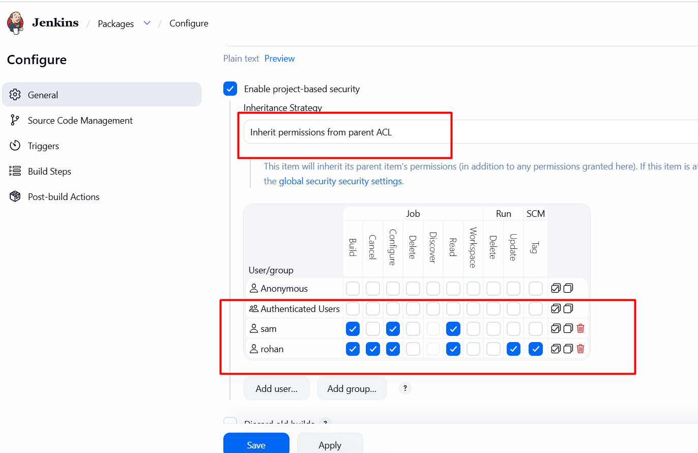

# Day 76: Jenkins Project Security

## 🎯 task
1. There is an existing Jenkins job named Packages, there are also two existing Jenkins users named `sam` with password `sam@pass12345` and `rohan` with password `rohan@pass12345`.

2. Grant permissions to these users to access Packages job as per details mentioned below:

a.) Make sure to select Inherit permissions from parent ACL under inheritance strategy for granting permissions to these users.

b.) Grant mentioned permissions to `sam` user : `build`, `configure` and `read`.

c.) Grant mentioned permissions to `rohan` user : `build`, `cancel`, `configure`, `read`, `update` and `tag`.

## 🧑‍💻 solution

## install jenkins plugin
`Matrix Authorization Strategy`

