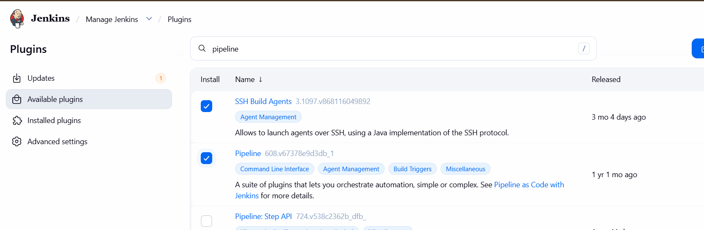
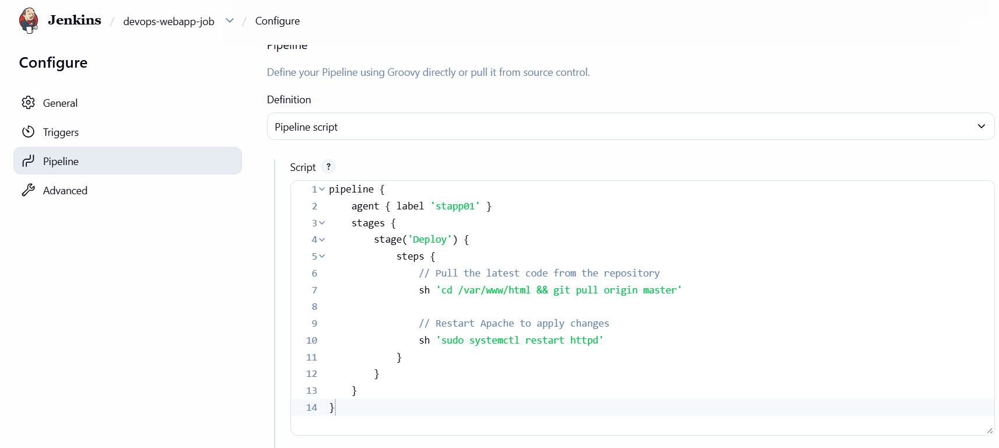

# Day 77: Jenkins Deploy Pipeline

## 🎯 task
Click on the Jenkins button on the top bar to access the Jenkins UI. Login using username admin and password Adm!n321.


Similarly, click on the Gitea button on the top bar to access the Gitea UI. Login using username `sarah` and password `Sarah_pass123`. There under user `sarah` you will find a repository named `web_app` that is already cloned on `App Server 1` under `/var/www/html`. `sarah` is a developer who is working on this repository.

1. Add a slave node named `App Server 1`. It should be labeled as `stapp01` and its remote root directory should be `/home/sarah/jenkins_agent` (the repository is cloned under `/var/www/html`; the agent uses a separate directory so it does not pollute the repo).

2. We have already cloned repository on App Server 1 under `/var/www/html`.

3. Apache is already installed on the app server and is running on port 8080.

4. Create a Jenkins pipeline job named `xfusion-webapp-job` (it must not be a Multibranch pipeline) and configure it to:

Deploy the code from web_app repository under `/var/www/html` on App Server 1, as this is the document root of the app server. The pipeline should have a single stage named `Deploy` ( which is case sensitive ) to accomplish the deployment.


## 🧑‍💻 solution
1. need install below plugins:
   - **SSH Agent plugin**
   - **Pipeline plugin**

2. To add credentials of app server 1 for the Jenkins agent, follow these steps:
    - Go to Jenkins dashboard and click on "Manage Jenkins".
    - Click on "Manage Credentials".
    - Click on "Global credentials (unrestricted)" and then click on "Add Credentials".
    - Select "SSH Username with password" as the kind of credential.

3. To add a slave node named App Server 1, follow these steps:

   - Go to Jenkins dashboard and click on "Manage Jenkins".
   - Click on "Manage Nodes and Clouds".
   - Click on "New Node" and enter the name "App Server 1".
   - Select "Permanent Agent" and click "OK".
   - Fill in the required details:
     - Remote root directory: /home/sarah/jenkins_agent
     - Labels: stapp01
     - Launch method: Launch agents via SSH
   - Click "Save".

4. To allow the Jenkins agent to restart Apache without a password, you need to edit the sudoers file on App Server 1. Follow these steps:

   - SSH into App Server 1 using the credentials of user `sarah`.
   - Open the sudoers file using the command `sudo visudo`.
   - Add the following line at the end of the file to allow user `sarah` to restart Apache without a password:

```bash
sudo yum install java-17-openjdk java-17-openjdk-devel -y
sudo visudo
sarah ALL=(ALL) NOPASSWD: /bin/systemctl restart httpd
``` 


5. To create a Jenkins pipeline job named xfusion-webapp-job, follow these steps:
    - Go to Jenkins dashboard and click on "New Item".
    - Enter the name "xfusion-webapp-job" and select "Pipeline", then click "OK".
    - In the pipeline configuration, scroll down to the "Pipeline" section.
    - Select "Pipeline script" and enter the following script:

```groovy
pipeline {
    agent { label 'stapp01' }
    stages {
        stage('Deploy') {
            steps {
                sh 'cd /var/www/html && git pull origin master'
                sh 'systemctl restart httpd'
            }
        }
    }
}
```
    




