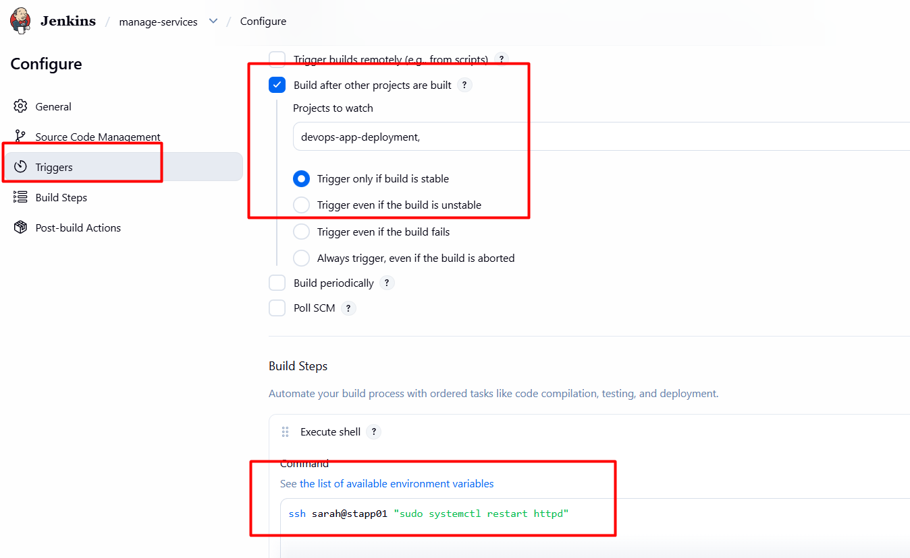

# Day 80: Jenkins Chained Builds

## 🎯 task
1. Create a Jenkins job named `devops-app-deployment` and configure it to pull changes from the master branch of the web repository on App Server 1 under /var/www/html directory.

2. Create another Jenkins job named `manage-services` and make it a downstream job for `devops-app-deployment`. Things to take care about this job are:

    a. This job should restart httpd service on the app server (App Server 1).

    b. Trigger this job only if the upstream job i.e `devops-app-deployment` is stable.

## 🧑‍💻 solution

